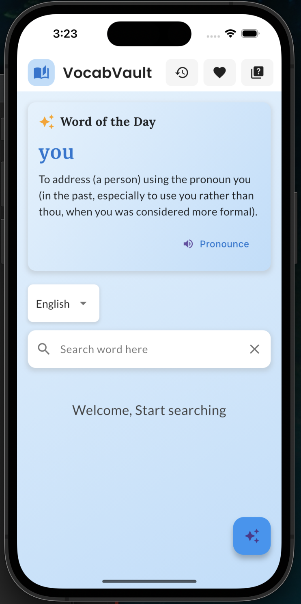
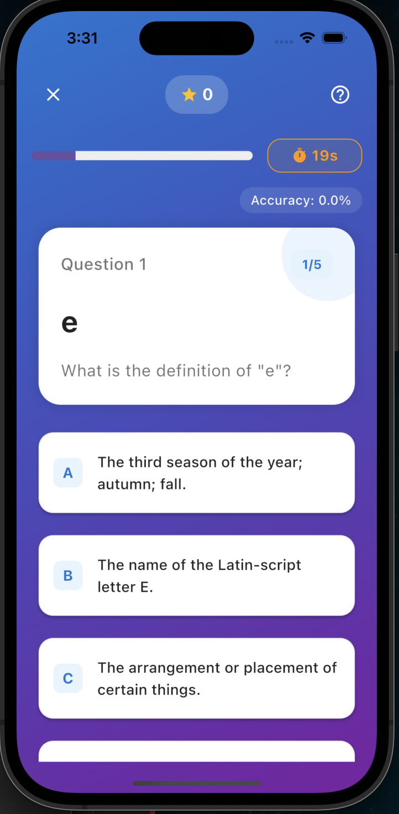
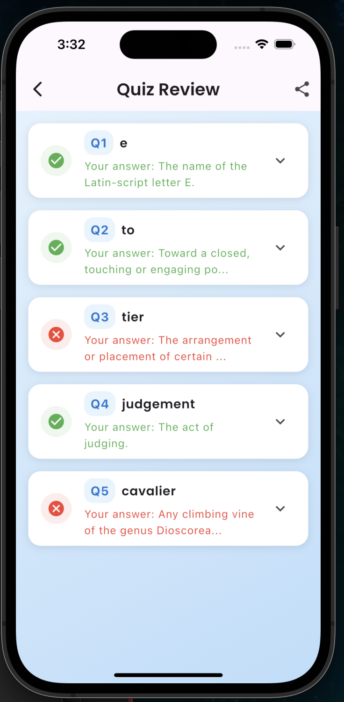

# VocabVault 📚

VocabVault is a modern, feature-rich vocabulary learning application built with Flutter. It combines dictionary functionality with interactive quizzes to make learning new words engaging and effective.

# VocabVault 📚

  
  
  
A modern vocabulary learning app that makes expanding your word knowledge fun and effective.

  
  
  

## 📱 Screenshots

  

    
    
    
  

## ✨ Key Features

### 📖 Dictionary
- **Smart Search**: Instant word lookups with auto-suggestions
- **Rich Word Details**: 
  - Detailed definitions
  - Audio pronunciations
  - Example sentences
  - Synonyms & antonyms
- **Personal Collection**: 
  - Save favorite words
  - View search history
  - Share words with friends

### 🎯 Interactive Quiz
- **Multiple Quiz Modes**:
  - Random words challenge
  - Practice with favorites
  - Daily word quiz
- **Engaging Features**:
  - 30-second timed questions
  - Streak multipliers
  - Point-based rewards
  - Helpful hints system
- **Progress Tracking**:
  - Real-time accuracy stats
  - Performance analytics
  - Detailed review system

### 🎨 Modern Design
- Sleek, intuitive interface
- Dark/Light theme support
- Smooth animations
- Responsive on all devices
- Visual feedback
- Achievement celebrations

## 🛠️ Technical Features

### Architecture
- GetX State Management
- Clean Architecture principles
- Modular design

### APIs and Services
- Dictionary API integration
- Local storage for favorites and history
- Text-to-speech functionality
- Share capabilities

### Performance
- Optimized animations
- Efficient state management
- Minimal resource usage

## 📱 Screenshots

| Home Screen | Quiz Screen | Results Screen |
|-------------|-------------|----------------|
| [Image 1]   | [Image 2]   | [Image 3]      |

